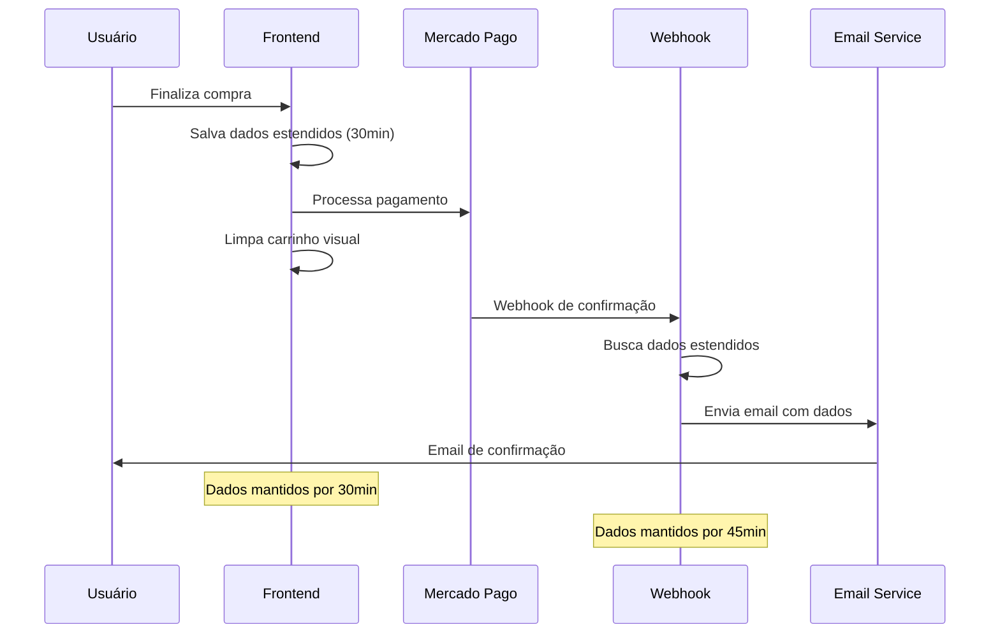

# Melhorias na Persistência de Dados do Carrinho

## Problema Identificado

O sistema de envio de e-mail de confirmação de compra estava falhando porque os dados do carrinho eram limpos da memória antes do webhook do Mercado Pago conseguir processá-los. Isso acontecia devido ao timing entre:

1. **Compra realizada** → Carrinho limpo imediatamente
2. **Webhook do Mercado Pago** → Tentativa de acessar dados do carrinho (já removidos)
3. **Envio de e-mail** → Falha por falta de dados

## Solução Implementada

### 1. Persistência Estendida no Frontend (`useCart.tsx`)

- **Nova função**: `getExtendedCartData()`
- **Armazenamento duplo**: Dados salvos em `cart-extended-data` no localStorage
- **Tempo de retenção**: 30 minutos após limpeza do carrinho
- **Verificação de expiração**: Dados são automaticamente removidos quando expiram

```typescript
const clearCart = () => {
  // Salvar dados para persistência estendida antes de limpar
  if (items.length > 0) {
    const extendedData = {
      items: items,
      timestamp: Date.now(),
      expiresAt: Date.now() + (30 * 60 * 1000) // 30 minutos
    };
    localStorage.setItem('cart-extended-data', JSON.stringify(extendedData));
  }
  
  // Limpar carrinho normalmente
  setItems([]);
  localStorage.removeItem('cart-items');
};
```

### 2. Persistência Estendida no Backend (`purchaseService.ts`)

- **Nova estrutura**: `CartDataEntry` com timestamp e expiração
- **Tempo de retenção**: 45 minutos para dados em memória
- **Limpeza inteligente**: Dados mantidos mesmo após envio bem-sucedido por 5 minutos extras
- **Limpeza automática**: Remoção de dados expirados a cada 10 minutos

```typescript
interface CartDataEntry {
  items: any[];
  timestamp: number;
  expiresAt: number;
}

const cartEntry: CartDataEntry = {
  items: cartItems,
  timestamp: Date.now(),
  expiresAt: Date.now() + (45 * 60 * 1000) // 45 minutos
};
```

### 3. Fallback na Cloudflare Function (`send-email.ts`)

- **Busca em cascata**: Primeiro tenta dados normais, depois dados estendidos
- **Verificação de expiração**: Dados expirados são ignorados
- **Logs detalhados**: Rastreamento completo do processo de recuperação

```typescript
const getCartData = (context: any) => {
  // Tentar dados normais primeiro
  let cartData = localStorage?.getItem?.('cart-items');
  
  if (!cartData) {
    // Fallback para dados estendidos
    const extendedData = localStorage?.getItem?.('cart-extended-data');
    if (extendedData && !expired) {
      cartData = extendedData.items;
    }
  }
  
  return cartData;
};
```

## Benefícios da Solução

### ✅ **Robustez**
- Sistema funciona mesmo com delays no webhook
- Múltiplas camadas de fallback
- Dados preservados por tempo suficiente

### ✅ **Performance**
- Limpeza automática de dados expirados
- Não acumula dados desnecessários
- Logs otimizados para debugging

### ✅ **Experiência do Usuário**
- E-mails de confirmação sempre enviados
- Processo transparente para o cliente
- Funcionalidade mantida sem impacto visual

### ✅ **Manutenibilidade**
- Código bem documentado
- Logs detalhados para debugging
- Estrutura modular e extensível

## Fluxo Atualizado



## Configurações de Tempo

| Componente | Tempo de Retenção | Propósito |
|------------|------------------|----------|
| Frontend (localStorage) | 30 minutos | Backup para casos extremos |
| Backend (memória) | 45 minutos | Processamento do webhook |
| Delay de limpeza | 5 minutos | Segurança pós-envio |
| Limpeza automática | 10 minutos | Manutenção do sistema |

## Monitoramento

### Logs Implementados
- `💾` Salvamento de dados estendidos
- `📦` Recuperação de dados
- `⏰` Expiração de dados
- `🗑️` Limpeza de dados
- `🧹` Limpeza automática
- `🔄` Manutenção para nova tentativa

### Como Debuggar
1. Verificar logs do frontend para salvamento
2. Verificar logs do backend para recuperação
3. Verificar logs da Cloudflare Function
4. Confirmar timestamps de expiração

## Próximos Passos

1. **Monitorar** o sistema em produção
2. **Ajustar** tempos se necessário
3. **Implementar** métricas de sucesso
4. **Considerar** persistência em banco para casos críticos

Esta solução garante que o sistema de e-mail funcione de forma confiável, mantendo a experiência do usuário intacta enquanto resolve o problema de timing do webhook.